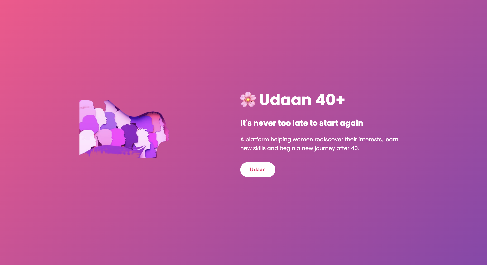
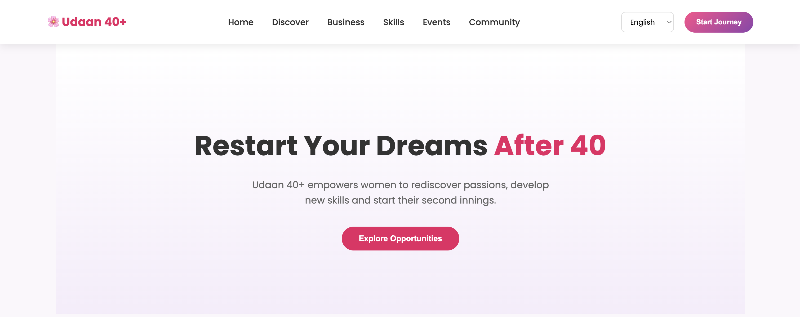
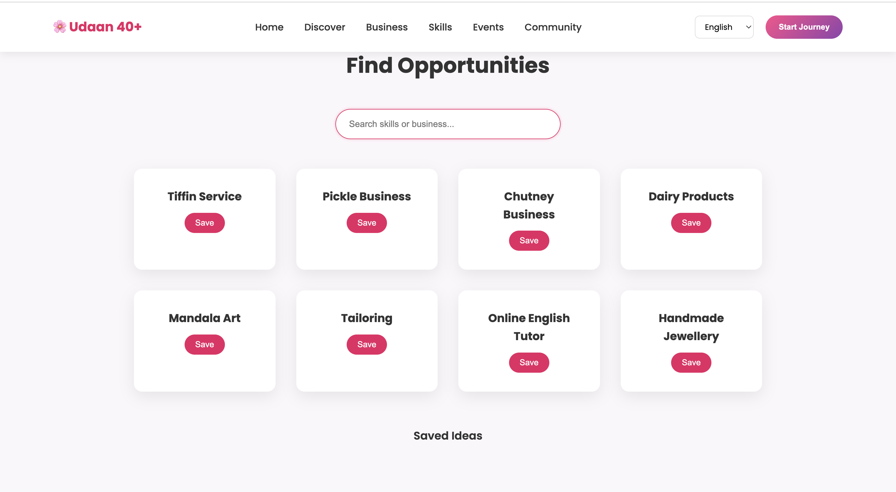
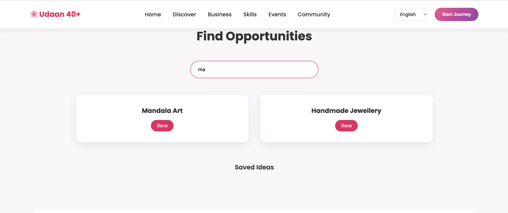
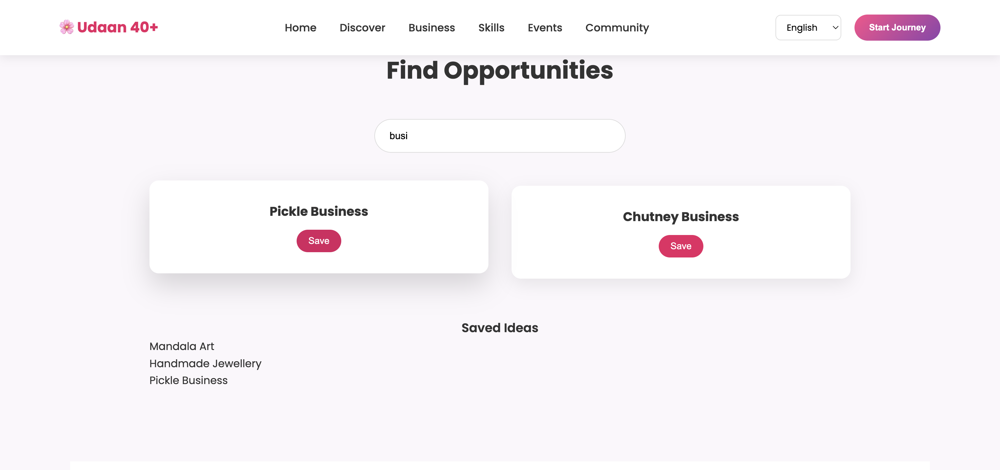
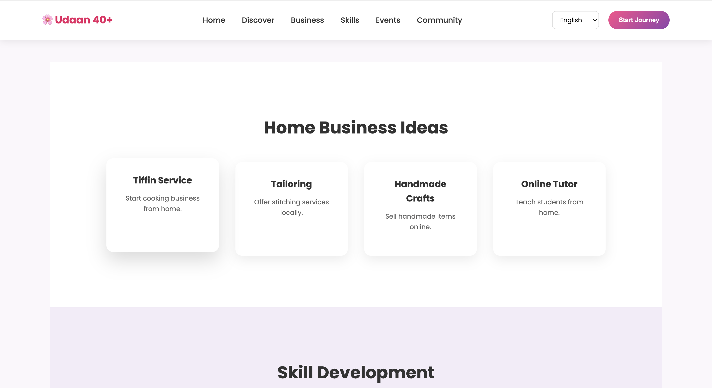
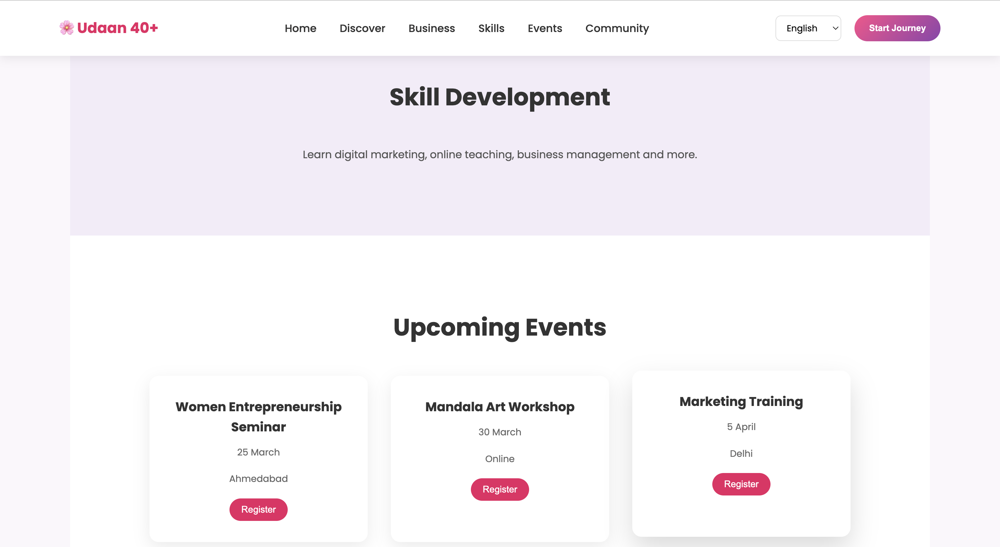
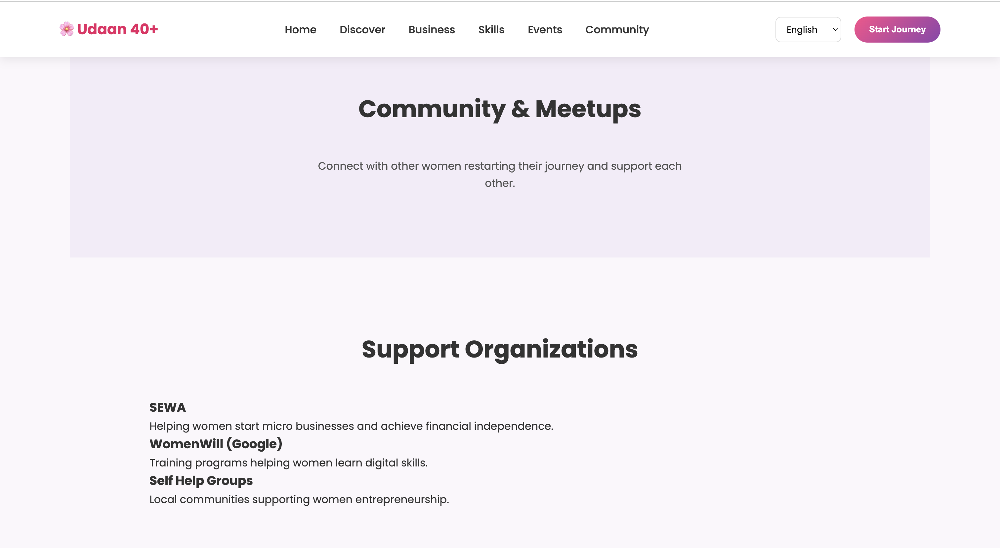

# 🌸 Udaan 40+

## Empowering Women to Restart Their Journey After 40

Udaan 40+ is a web platform designed to support women who want to restart their personal or professional journey after the age of 40. Many women pause their careers due to family responsibilities, and this platform helps them rediscover opportunities, develop new skills, and gain the confidence to start again.

This project was built as part of a Women's Day themed web development challenge.

---

## 🚀 Problem Statement

Many women above the age of 40 face challenges such as:

- Career gaps due to family responsibilities  
- Lack of awareness about small business opportunities  
- Limited access to digital skills  
- Lack of community support  

Udaan 40+ aims to bridge this gap by providing opportunities, learning resources, and community connections.

---

## ✨ Features

### 🔍 Opportunity Finder
Users can search for opportunities such as:

- Pickle business  
- Tiffin services  
- Mandala art  
- Tailoring  
- Online tutoring  

The platform suggests business ideas based on user interests.

---

### 💡 Home Business Ideas
Provides inspiration for low-investment home businesses such as:

- Homemade food services  
- Craft and handmade products  
- Teaching and tutoring  
- Digital freelancing  

---

### 📚 Skill Development
Encourages women to learn valuable skills including:

- Digital marketing  
- Online teaching  
- Creative skills like art and crafts  
- Communication and language skills  

---

### 📅 Events & Workshops
Users can explore upcoming events such as:

- Entrepreneurship seminars  
- Skill workshops  
- Community meetups  

These events help women gain knowledge and connect with others.

---

### 🤝 Community Support
The platform encourages networking and support among women who are restarting their journey.

Users can:

- Connect with others  
- Share experiences  
- Get guidance and mentorship  

---

### 🌍 Multilingual Support
The platform supports multiple languages to ensure accessibility for a wider audience.

Languages included:

- English  
- Hindi  
- Gujarati  

---

### ❤️ NGO Support
Udaan 40+ highlights organizations that support women empowerment such as:

- SEWA  
- Google WomenWill  
- Self Help Groups  

These organizations provide training, mentorship, and financial support.

---

## 🛠 Tech Stack

Frontend:
- React (Vite)
- JavaScript
- HTML
- CSS

Tools:
- Git
- GitHub

---

## 📂 Project Structure

```
src
 ├ components
 │   ├ Navbar.jsx
 │   ├ Hero.jsx
 │   ├ Finder.jsx
 │   ├ Business.jsx
 │   ├ Skills.jsx
 │   ├ Events.jsx
 │   ├ Community.jsx
 │   ├ NGOs.jsx
 │   └ Footer.jsx
 │
 ├ data
 │   ├ ideas.js
 │   └ lang.js
 │
 ├ styles
 │   └ style.css
 │
 ├ App.jsx
 └ main.jsx
```

---

## ⚡ How to Run the Project

Clone the repository

```
git clone https://github.com/YOUR_USERNAME/udaan40.git
```

Navigate to the project folder

```
cd udaan40
```

Install dependencies

```
npm install
```

Run the development server

```
npm run dev
```

Open in browser

```
http://localhost:5173
```

---

## 🎯 Future Improvements

Possible enhancements:

- Google OAuth authentication  
- AI-based opportunity recommendations  
- Event registration system  
- Mentor matching system  
- Freelance and job opportunities  

---

## 💜 Vision

Udaan 40+ aims to create a world where age is never a barrier to new beginnings.

Women deserve opportunities to rediscover their passions, develop new skills, and build successful ventures at any stage of life.

---
## 📸 Screenshots

### Welcome Page



## Landing Page



### Opportunity Finder





### Save Opportunity



### Business Ideas



### Events Section



### Community Section


## 👩‍💻 Author

Digisha Adhaduk  
B.Tech Computer Science Engineering  
Full Stack Developer

---

## 🌸 Inspiration

Inspired by the idea that:

**"It's never too late to start again."**